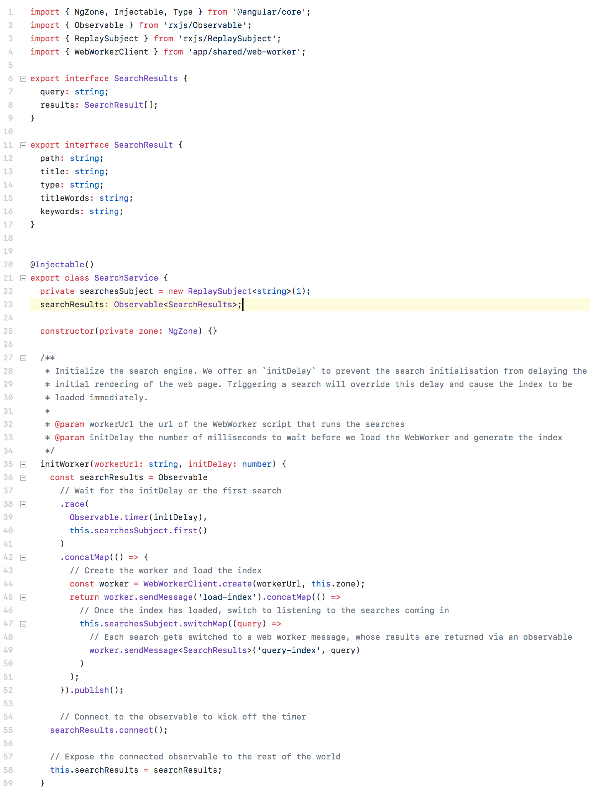

# GitHub Theme for Visual Studio Code
The purpose is to provide a color theme for Visual Studio Code as close as it can get to the real GitHub code styling.

## Info
This theme has been optimized for JavaScript, TypeScript, CSS, SASS(SCSS), HTML and Shell. Other languages are not tested and may differ from the github code styles. Please file an issue or submit a PR in this case.

## Issues, Feedback
If you find any issues, bugs, missing stylings or feedback please feel free to [file an issue](https://github.com/thomaspink/vscode-github-theme/issues).
